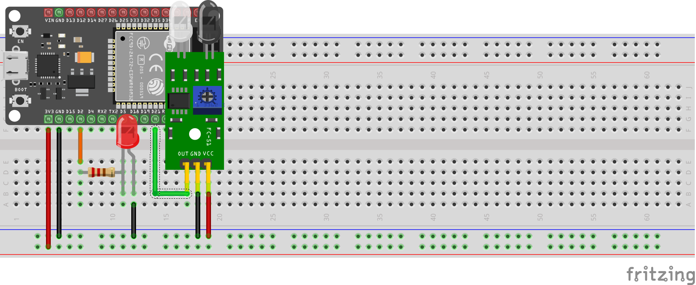

# Sistema IoT de Monitoreo IR con Actualización OTA (ESP-IDF)

Este proyecto implementa un nodo IoT basado en ESP32 utilizando el framework oficial de Espressif (ESP-IDF). El sistema detecta la presencia de objetos mediante un sensor infrarrojo, reporta el estado vía MQTT con TLS/SSL y permite el control remoto de un actuador (LED), además de soportar actualizaciones de firmware inalámbricas (OTA).



## Características

* **Detección de Objetos:** Uso de sensor IR (FC-51) para detección de proximidad.
* **Modos de Operación:**
    * *Automático:* El LED se enciende al detectar un objeto.
    * *Manual:* Control del LED vía comandos MQTT (ignora el sensor).
* **Conectividad Segura:** Cliente MQTT sobre TLS/SSL (MQTTS).
* **Actualizaciones OTA:** Capacidad de actualizar el firmware remotamente vía HTTPS.
* **Identidad Única:** Generación de UUID basado en la MAC address del ESP32.
* **Persistencia:** Uso de NVS (Non-Volatile Storage) para configuraciones.

## Hardware Requerido

* **Microcontrolador:** ESP32 DevKit V1 (ESP-WROOM-32).
* **Sensor:** Módulo Infrarrojo de Obstáculos (FC-51).
* **Actuador:** LED (Cualquier color).
* **Resistencia:** 220Ω o 330Ω (para el LED).
* **Conexiones:** Cables Jumper y Protoboard.

## Diagrama de Conexiones (Pinout)

La configuración de pines está definida en `main/simple_ota_example.c`:

| Componente | Pin ESP32 | Descripción |
| :--- | :--- | :--- |
| **LED** | GPIO 2 | Actuador (Salida) |
| **Sensor IR** | GPIO 21 | Entrada Digital (Active LOW) |

> **Nota:** El sensor IR debe calibrarse usando el potenciómetro integrado para ajustar la distancia de detección.

## Instalación y Configuración

### 1. Clonar el repositorio
```bash
cd <NOMBRE_DE_TU_CARPETA>
git clone <URL_DEL_REPO>
